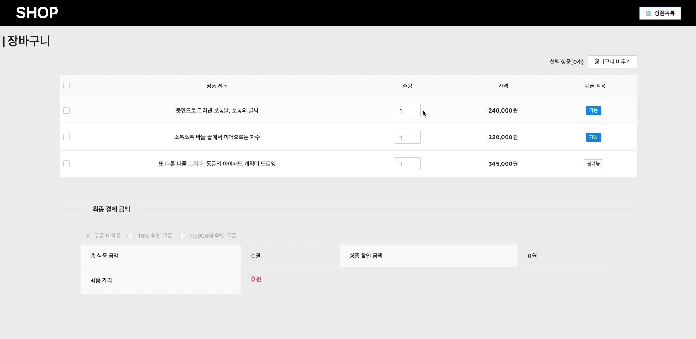

# 🛒 장바구니 시스템

### 서버 실행

```
$ npx json-server ./data.json --port 4000
```

### Dependencies 추가 & 시작

```
$ yarn install
$ yarn start
```

### STACK

- [x] React, React Hooks
- [x] Redux
- [x] immer, axios, json-server, antd, react-router-dom

### 구현 내용

- [x] **상품 목록 페이지 (route: `/products`)**


1. 각 상품은 `가격`, `사진`, `상품 제목` 을 표시한다
2. 상품의 `score`를 기준으로 내림차순 정렬하여 `5개`씩 보여주는 페이지네이션을 구현한다.
3. 각 상품에는 `장바구니 버튼`이 있다.

- 1.  상품이 장바구니에 담겨 있지 않은 경우 - `담기` 버튼 구현
- 2.  상품이 장바구니에 담겨 있는 경우 - `빼기` 버튼 구현

* [x] **장바구니 페이지 (route: `/cart`)**


1. 장바구니에는 최대 `3개`의 상품이 담길 수 있다.
2. 장바구니의 상품 중 결제에 포함할 상품을 `체크박스`로 선택할 수 있다.
3. 장바구니에 담긴 각 상품의 `수량을 선택`할 수 있다.

- 단, 최소 1개의 수량이 지정되어야 함

4. 장바구니에 담긴 전체 상품의 `최종 결제 금액`에 대하여 `쿠폰`을 적용할 수 있다.

- 쿠폰은 두 가지 type을 가지고 있다.
- 1. 정액 할인(amount) - `{discountAmount}원` 만큼 할인한다.
- 2. 비율 할인(rate) - `{discountRate}%` 만큼 할인한다.
- 상품 중에는 쿠폰 사용이 불가능한 상품(`availableCoupon == false`)이 존재한다.
  - 이 상품들은 쿠폰 할인 계산에서 제외한다.

5. 최종 결제 금액을 장바구니 페이지 하단에 보여준다

- 소수점 가격은 **버림 처리** 한다.

6. 장바구니 상품 삭제하기 기능 추가
